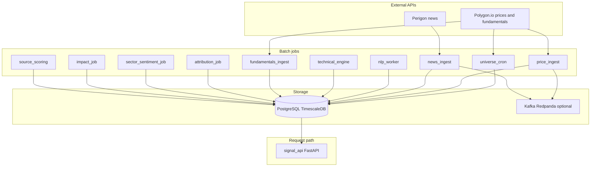

# Architecture

This repository is a **batch-oriented quantitative signal platform**: data is ingested on a schedule (or manually), stored in PostgreSQL + TimescaleDB, optionally streamed on Kafka, and **read on demand** by the HTTP signal API. It is **not** a low-latency intraday trading stack unless you extend ingestion and feature cadence.

## High-level diagram

## Runtime model

| Layer | Behavior |
|-------|----------|
| **Cron / manual jobs** | Run to completion, exit 0 on NYSE **non-session** days when `exit_if_not_nyse_trading_day()` is used (see [job_guards.py](../src/signal_common/job_guards.py)). |
| **signal_api** | Long-running HTTP server; each `GET /v1/signals` computes scores from **latest** DB state (technicals, news aggregates, fundamentals, regime, attribution, sector sentiment snapshot). |
| **Kafka** | Optional for OHLCV and raw news topics; the API does not require Kafka to return signals if the DB is populated. |

## Shared library: `src/signal_common`

Code under `src/signal_common` is the **single package** imported by all services (`PYTHONPATH=src` or editable install). Responsibilities:

| Module | Role |
|--------|------|
| [config.py](../src/signal_common/config.py) | Pydantic settings from environment (`.env`); API keys, thresholds, weights |
| [db.py](../src/signal_common/db.py) | asyncpg pool, ordered SQL migrations, ticker normalization, benchmark symbol seeds |
| [schemas.py](../src/signal_common/schemas.py) | Pydantic models for API payloads and Kafka bar shapes |
| [polygon_client.py](../src/signal_common/polygon_client.py) | REST calls to Polygon (aggregates, ticker details, financials) |
| [perigon_client.py](../src/signal_common/perigon_client.py) | Perigon article listing |
| [kafka_bus.py](../src/signal_common/kafka_bus.py) | Topic names and producer/consumer helpers |
| [market_calendar.py](../src/signal_common/market_calendar.py) + [job_guards.py](../src/signal_common/job_guards.py) | NYSE calendar via `exchange_calendars`; skip jobs on holidays/weekends |
| [indicators.py](../src/signal_common/indicators.py) | RSI, MACD, Bollinger, VWAP helpers used by `technical_engine` |
| [signal_logic.py](../src/signal_common/signal_logic.py) | Pure functions: blend weights, regime dampening hooks, thesis text, fundamental parsing |
| [sector_etfs.py](../src/signal_common/sector_etfs.py) | Map free-text sector/industry strings to a liquid sector ETF ticker |
| [attribution_math.py](../src/signal_common/attribution_math.py) | Return windows, rolling beta vs SPY, peer percentile math |
| [sector_sentiment.py](../src/signal_common/sector_sentiment.py) | Cross-sectional z-scores and rank percentiles for sector aggregates |

## Data dependency chain (recommended mental model)

1. **Symbols** exist (`universe_cron`) so tickers can be joined everywhere.
2. **OHLCV** exists (`price_ingest`) for stocks and benchmark ETFs (SPY, sector ETFs, QQQ, etc.).
3. **Filtered universe** is the investable set for downstream jobs.
4. **Technical features + regime** (`technical_engine`) need daily bars for symbols and benchmarks.
5. **News** (`news_ingest`) matches headlines to tickers; **NLP** (`nlp_worker`) fills `news_sentiment`.
6. **Fundamentals** (`fundamentals_ingest`) enriches symbols that have Polygon access.
7. **Move attribution** (`attribution_job`) explains recent returns vs SPY/sector/peers; **signal_api** reads the latest snapshot.
8. **Sector sentiment** (`sector_sentiment_job`) aggregates weighted news by `sector_key` and joins benchmark ETF returns; **signal_api** exposes `sector_context` and `GET /v1/sector-sentiment`.
9. Optional: **impact_job** and **source_scoring** refine how much weight to give publishers over time.

## Configuration surface

- **`.env` / environment**: see [`.env.example`](../.env.example). Critical variables include `DATABASE_URL`, `POLYGON_API_KEY`, `PERIGON_API_KEY`, `KAFKA_BOOTSTRAP_SERVERS`, signal thresholds, and `SIGNALS_ONLY_ON_TRADING_DAYS`.
- **Migrations**: applied in filename order by [db.py `run_migrations`](../src/signal_common/db.py); see [DATA_MODEL.md](DATA_MODEL.md).

## Kubernetes

See [deploy/k8s/README.md](../deploy/k8s/README.md). Cron schedules are **UTC**; application code still enforces NYSE session rules inside jobs.
