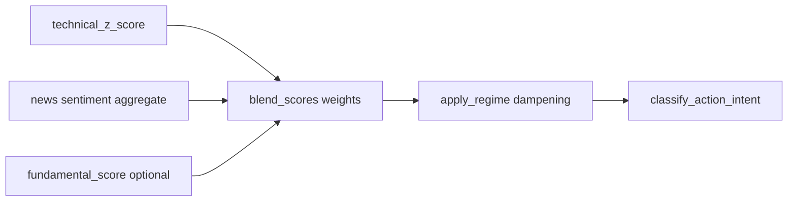

# Signal pipeline and semantics

This document explains **what the model is doing** when `signal_api` builds a response. It is **not** investment advice; scores are heuristics for research and monitoring.

## Request-time computation

`GET /v1/signals` does **not** train a model per request. It **reads current DB state** and applies deterministic formulas in [signal_logic.py](../src/signal_common/signal_logic.py) and [signal_api/main.py](../services/signal_api/main.py).

### Technical score

From latest `technical_features` plus last daily close: a heuristic in `technical_z_score()` maps RSI, MACD, and Bollinger band position to approximately `[-1, 1]`.

### Sentiment score

From `news_sentiment` joined with articles in the last 14 days, **averaged per ticker**, weighted by `publisher_scores.influence_score` (clamped) and down-weighted when `is_noise` is true. See `_fetch_sentiment_map` in [signal_api/main.py](../services/signal_api/main.py).

### Fundamental score

If `fundamentals_snapshot` exists for the symbol, `fundamental_score` is blended in; if missing, the fundamental weight is redistributed to technical and sentiment (`blend_scores`).

### Regime adjustment

[apply_regime](../src/signal_common/signal_logic.py) multiplies **positive** blended scores by `buy_dampening_factor` from `regime_snapshot` (e.g. SPY below 200DMA and/or elevated VIX). Negative scores are not dampened upward.

### Action and intent

[classify_action_intent](../src/signal_common/signal_logic.py) maps conviction to `SignalAction` (BUY / SELL / HOLD) and `PositionIntent` (long, short, reduce, flat) using `signal_buy_threshold`, `signal_short_threshold`, and `signal_exit_threshold`.

### Watchlist

HOLD names with absolute conviction above `watchlist_abs_conviction_min`.

## Move attribution (why did price move recently?)

Populated by `attribution_job` into `attribution_snapshot` and merged in the API as `move_attribution` on each [SignalRecord](../src/signal_common/schemas.py).

Conceptually (5 trading-day window, aligned daily bars):

- **SPY return** — broad market move.
- **Beta vs SPY (60 daily returns)** — rolling OLS-style beta; noisy on short samples (`data_quality` may flag insufficient history).
- **Market-explained component** — beta times SPY 5d return (co-movement proxy).
- **Residual** — stock 5d return minus that market-explained piece (idiosyncratic vs the SPY factor).
- **Sector ETF** — return of `benchmark_etf` and spread vs SPY; **sector_component** scales the sector-vs-SPY strip by the same beta as a simple v1 heuristic.
- **Peer percentile** — rank of the stock’s 5d return among other symbols in the same `sector_key` within the **filtered universe**.

Narrative text is generated in [signal_logic.py](../src/signal_common/signal_logic.py) (`build_move_attribution_narrative`) and appended to the thesis string.

**Important:** This explains **recent** co-movement; it does **not** guarantee future performance or causal identification (news, earnings, flows, etc. are not isolated here).

## Market context

`SignalsPayload.market_context` includes SPY/QQQ approximate 5d returns from OHLCV and VIX / dampening from `regime_snapshot` when available—useful for “tape” context alongside per-name attribution.

## Sector sentiment (aggregate news vs sector ETF tape)

Populated by `sector_sentiment_job` into `sector_sentiment_snapshot` (see [DATA_MODEL.md](DATA_MODEL.md)). The API exposes:

- `SignalsPayload.sector_context` on `GET /v1/signals` (latest snapshot rows), and
- `GET /v1/sector-sentiment` for the same data in a compact payload.

Per `sector_key` (14d rolling window, same publisher-weighting as ticker sentiment):

- **weighted_sentiment_avg** — average article sentiment for symbols in that sector.
- **etf_return_5d / etf_return_20d** — returns of `benchmark_etf` from daily OHLCV.
- **sentiment_z_cross_sector** — z-score of sector sentiment vs other sectors that day.
- **performance_sentiment_spread** — difference between **sentiment rank percentile** and **ETF return rank percentile** (narrative vs tape; not causal).
- **divergence_flag** — exploratory flag when sentiment sign and ETF 5d return disagree materially.

**Global extension:** `symbols.region`, `country`, `market_currency` (nullable) are reserved for future non-US universes; v1 US behavior does not require them.

## Exploratory correlations (offline)

[scripts/research/correlation_scan.py](../scripts/research/correlation_scan.py) prints Pearson matrices and lag scans on CSVs or `--demo` synthetic data. **Research only**—correlation is not causation.

## Persistence

When `PERSIST_SIGNAL_RUNS` is true, the full JSON payload is inserted into `signal_runs` for audit (API consumers should treat as sensitive operational data).

## Configuration knobs

See [config.py](../src/signal_common/config.py): weights (`weight_technical`, `weight_sentiment`, `weight_fundamental`), thresholds, regime parameters, and API behavior flags.
